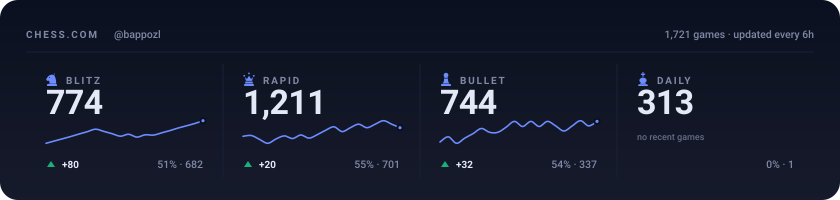
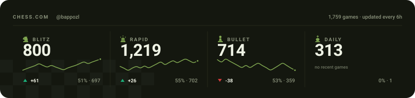
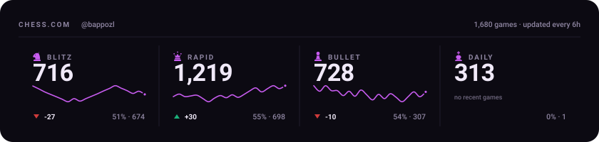
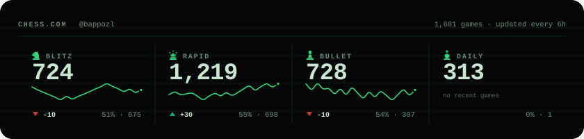
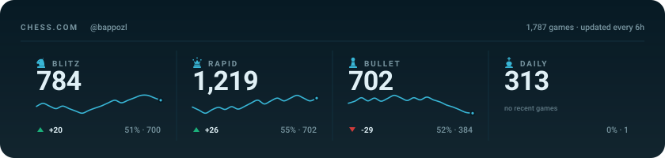

# Chess.com Stats for GitHub README

Display your Chess.com statistics on your GitHub profile with automatically updated SVG graphics.


## Features

- **Free** - Uses only free GitHub resources
- **Automatic Updates** - GitHub Actions updates every 6 hours
- **No Server Required** - Static SVG files, no hosting needed
- **8 Themes** - All themes generated automatically, just choose the URL
- **Line Charts** - Rating evolution for Rapid, Blitz, Bullet, and Daily

## Quick Start

### 1. Fork this Repository

Click the **Fork** button at the top of this page.

### 2. Configure Your Username

Go to **Settings** > **Secrets and variables** > **Actions** > **Variables**

Create a variable:

- **Name:** `CHESS_USERNAME`
- **Value:** Your Chess.com username

### 3. Run the Workflow

1. Go to **Actions** tab
2. Click **Update Chess.com Stats**
3. Click **Run workflow**

### 4. Add to Your Profile README

Copy one of the URLs below and paste in your README:

## Themes

All 8 themes are generated automatically. Choose your favorite:

### Dark (Default)

```markdown

```


### Light

```markdown

```


### Midnight

```markdown

```



### Chess Classic

```markdown

```



### Wood

```markdown

```


### Neon

```markdown

```



### Matrix

```markdown

```



### Ocean

```markdown

```



## Line Charts

Rating history charts are also available for each game mode and theme.

### URL Pattern

```
chess-stats-{mode}.svg           # Dark theme (default)
chess-stats-{mode}-{theme}.svg   # Other themes
```

Where `{mode}` is: `rapid`, `blitz`, `bullet`, or `daily`

### Examples

```markdown
<!-- Rapid - Dark theme -->


<!-- Blitz - Neon theme -->


<!-- Bullet - Matrix theme -->


```

## All Available Files

After running the workflow, these files are generated:

| File                             | Description                 |
| -------------------------------- | --------------------------- |
| `chess-stats.svg`                | Main card (dark)            |
| `chess-stats-{theme}.svg`        | Main card (other themes)    |
| `chess-stats-rapid.svg`          | Rapid chart (dark)          |
| `chess-stats-rapid-{theme}.svg`  | Rapid chart (other themes)  |
| `chess-stats-blitz.svg`          | Blitz chart (dark)          |
| `chess-stats-blitz-{theme}.svg`  | Blitz chart (other themes)  |
| `chess-stats-bullet.svg`         | Bullet chart (dark)         |
| `chess-stats-bullet-{theme}.svg` | Bullet chart (other themes) |
| `chess-stats-daily.svg`          | Daily chart (dark)          |
| `chess-stats-daily-{theme}.svg`  | Daily chart (other themes)  |

**Themes:** `light`, `midnight`, `chess`, `wood`, `neon`, `matrix`, `ocean`

## Local Development

```bash
git clone https://github.com/your-username/chess_readme_status.git
cd chess_readme_status
npm install
CHESS_USERNAME=your_username npm run generate
```

### Windows

```powershell
$env:CHESS_USERNAME="your_username"
npm run generate
```

## Update Frequency

Stats update automatically **every 6 hours** (4 times per day).

## License

MIT License - See [LICENSE](LICENSE) for details.
