# chess-readme-status

Chess.com stats for your GitHub profile, auto-updated via Actions — no server required.

<div align="center">
  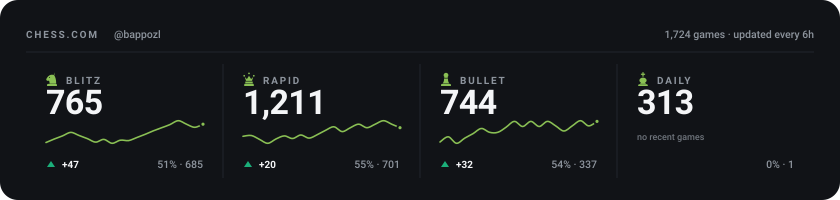
</div>

## Features

- **Free** — GitHub Actions + static SVG, no server
- **Auto-updates** — runs every 6 hours
- **8 styles** — premium, editorial, wood, tech, glass, piece, light, light-editorial
- **3 card types** — summary (all 4 modes), line chart, hero card
- **72 SVGs** — all styles × all card types generated automatically

## Quick Start

### 1. Fork this repository

### 2. Set your username

**Settings → Secrets and variables → Actions → Variables**

| Name | Value |
|---|---|
| `CHESS_USERNAME` | your Chess.com username |

### 3. Run the workflow

**Actions → Update Chess.com Stats → Run workflow**

### 4. Add to your README

```markdown

```

---

## URL pattern

```
chess-stats.svg                          # summary, premium dark (default)
chess-stats-{style}.svg                  # summary, other style
chess-stats-{mode}.svg                   # line chart, premium dark
chess-stats-{mode}-{style}.svg           # line chart, other style
chess-stats-{mode}-hero.svg              # hero card, premium dark
chess-stats-{mode}-hero-{style}.svg      # hero card, other style
```

**`{mode}`**: `blitz` · `rapid` · `bullet` · `daily`

**`{style}`**: `editorial` · `wood` · `tech` · `glass` · `piece` · `light` · `light-editorial`

_(omit style for the default `premium` dark)_

---

## Styles

### Premium (default) — `#8ac054`

```markdown

```


### Editorial — `#d8a24a`

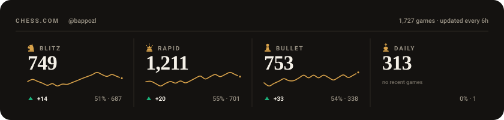

### Tech/Data — `#48d1ae`

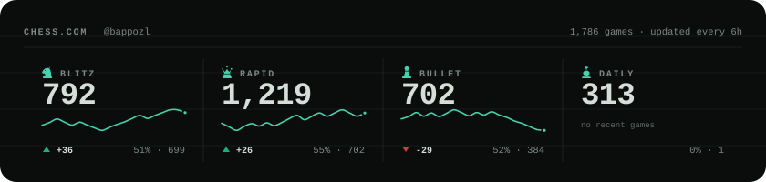

### Glass Depth — `#8098ff`

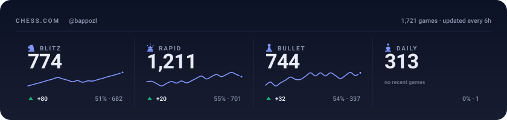

### Classic Wood — `#e7bd6b`

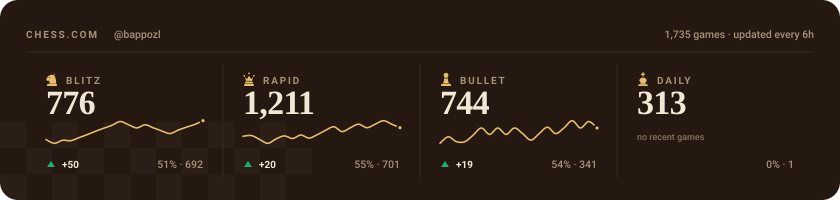

### Piece Hero — `#9bd35e`

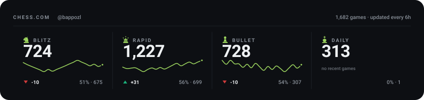

### Light — `#5f8f37`

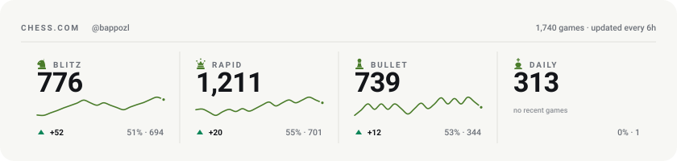

### Light Editorial — `#a9762a`

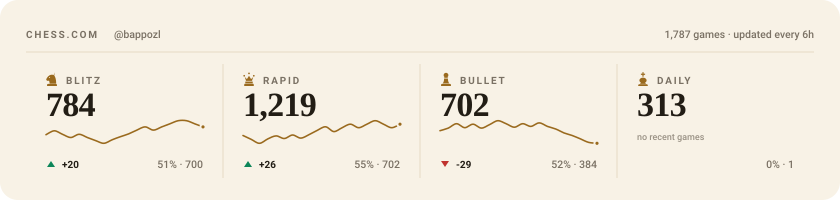

---

## Card types

### Summary (840×200) — all 4 modes in one strip

```markdown

```

### Line chart (470×210) — rating history per mode

```markdown

```

<div align="center">
  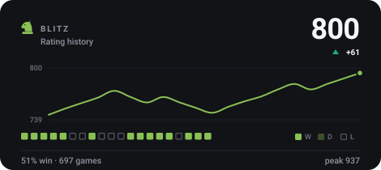
  &nbsp;&nbsp;
  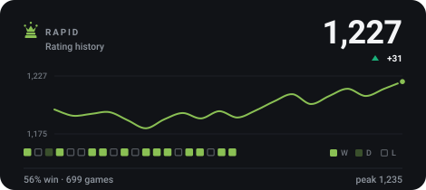
</div>

### Hero card (340×210) — single mode with piece

```markdown

```

<div align="center">
  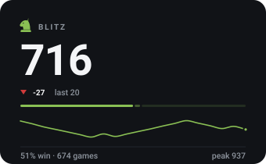
  &nbsp;
  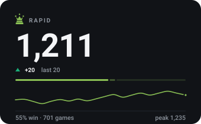
  &nbsp;
  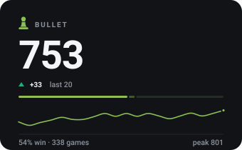
</div>

---

## Usage examples

### Summary + two line charts

```html
<div align="center">
  
  <br/>
  
  &nbsp;&nbsp;
  
</div>
```

### Hero cards side by side (glass style)

```html
<div align="center">
  
  &nbsp;
  
</div>
```

### Clickable card

```html
<a href="https://www.chess.com/member/YOUR_CHESS_USERNAME">
  
</a>
```

---

## Updates

Stats are fetched from the Chess.com public API and regenerated **every 6 hours** via GitHub Actions (`cron: "0 */6 * * *"`). You can also trigger manually via **Actions → Run workflow**.

---

## Local development

```bash
git clone https://github.com/your-username/chess_readme_status.git
cd chess_readme_status
npm install
CHESS_USERNAME=your_username /usr/bin/node scripts/generate-svg.js
```

---

## License

MIT — see [LICENSE](LICENSE)
