# chess-readme-status

Chess.com stats for your GitHub profile, auto-updated via Actions — no server required.

## Features

- **Free** — GitHub Actions + static SVG, no server
- **Auto-updates** — runs every 6 hours
- **15 styles** — premium, editorial, wood, tech, glass, piece, light, light-editorial, chess, matrix, midnight, neon, ocean, github, github-light
- **13 card types** — summary, line chart, hero card, plus README formats: activity calendar, git log, ticker, chessfetch, code card, last game board, white vs black, openings, medallions, bare type
- **330 SVGs** — all styles × all card types generated automatically

## Quick Start

### 1. Fork this repository

### 2. Set your username

**Settings → Secrets and variables → Actions → Variables**

| Name | Value |
|---|---|
| `CHESS_USERNAME` | your Chess.com username |

### 3. Run the workflow

**Actions → Update Chess.com Stats → Run workflow**

### 4. Add to your README

```markdown

```

---

## URL pattern

```
chess-stats.svg                          # summary, premium dark (default)
chess-stats-{style}.svg                  # summary, other style
chess-stats-{mode}.svg                   # line chart, premium dark
chess-stats-{mode}-{style}.svg           # line chart, other style
chess-stats-{mode}-hero.svg              # hero card, premium dark
chess-stats-{mode}-hero-{style}.svg      # hero card, other style
chess-medal-{mode}.svg                   # medallion (add -{style} for other styles)
chess-{card}.svg                         # README formats, premium dark
chess-{card}-{style}.svg                 # README formats, other style
```

**`{card}`**: `activity` · `gitlog` · `ticker` · `fetch` · `code` · `last-game` · `colors` · `openings` · `bare`

**`{mode}`**: `blitz` · `rapid` · `bullet` · `daily`

**`{style}`**: `editorial` · `wood` · `tech` · `glass` · `piece` · `light` · `light-editorial` · `chess` · `matrix` · `midnight` · `neon` · `ocean` · `github` · `github-light`

_(omit style for the default `premium` dark)_

---

## Styles

### Premium (default) — `#8ac054`

```markdown

```

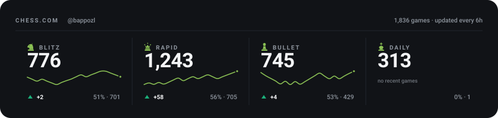

### Editorial — `#d8a24a`

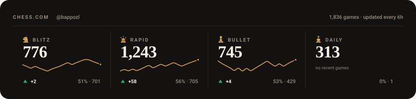

### Tech/Data — `#48d1ae`

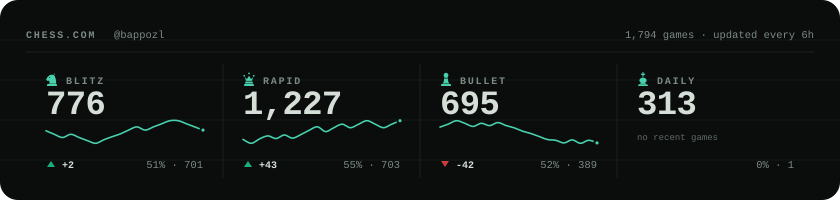

### Glass Depth — `#8098ff`

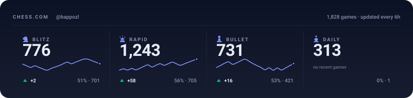

### Classic Wood — `#e7bd6b`

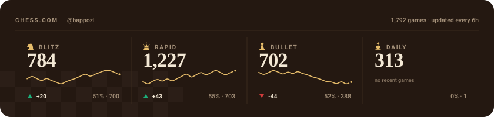

### Piece Hero — `#9bd35e`

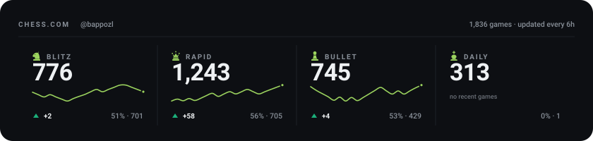

### Light — `#4a7c2a`

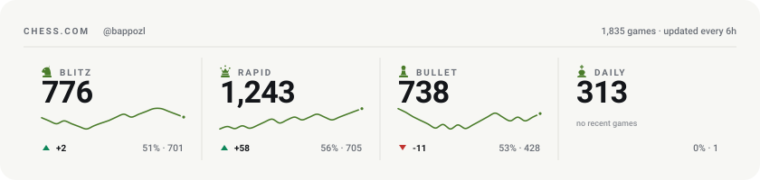

### Light Editorial — `#9a6a1e`

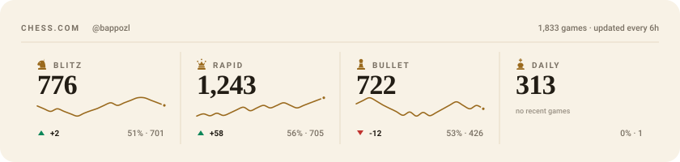

### Chess — `#7fa650`

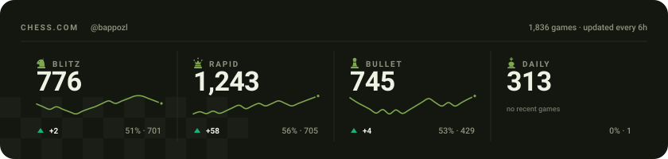

### Matrix — `#35d67a`

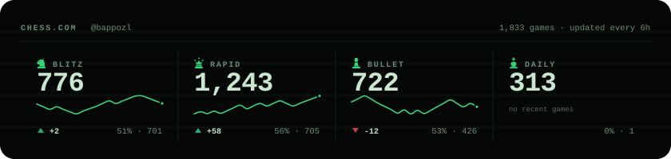

### Midnight — `#6d8dff`

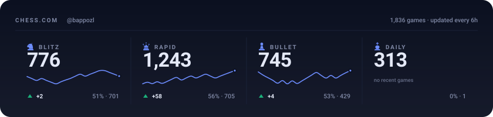

### Neon — `#c85cf0`

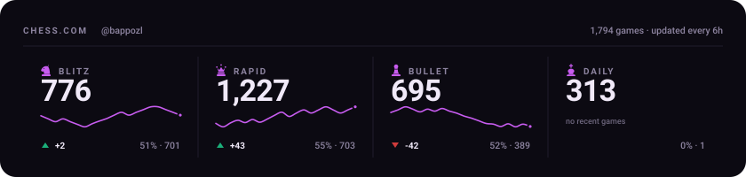

### Ocean — `#38b6d6`

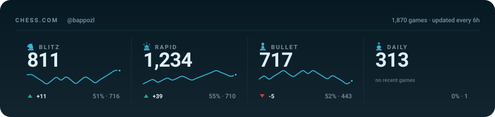

### GitHub — `#81b64c`

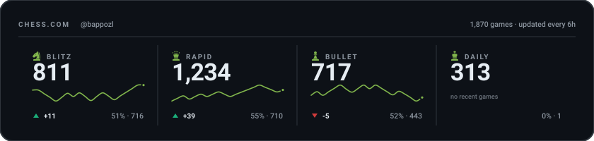

### GitHub Light — `#3d7a1c`

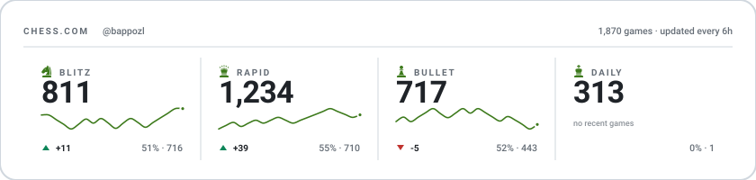

---

## Card types

### Summary (840×200) — all 4 modes in one strip

```markdown

```

<details>
<summary>Summary in all 15 styles</summary>

**`premium`**


**`editorial`**


**`wood`**


**`tech`**


**`glass`**


**`piece`**


**`light`**


**`light-editorial`**


**`chess`**


**`matrix`**


**`midnight`**


**`neon`**


**`ocean`**


**`github`**


**`github-light`**


</details>

### Line chart (470×210) — rating history per mode

```markdown

```

<div align="center">
  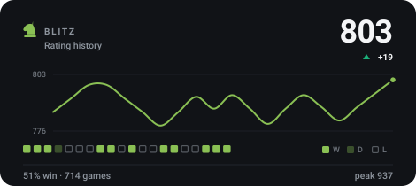
  &nbsp;&nbsp;
  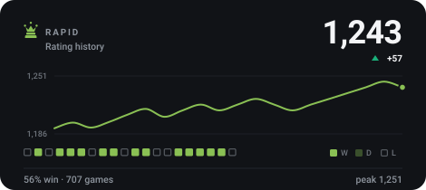
</div>

<details>
<summary>Line chart in all 15 styles</summary>

**`premium`**


**`editorial`**

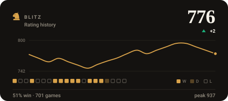

**`wood`**

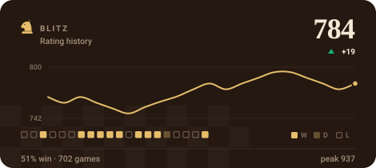

**`tech`**

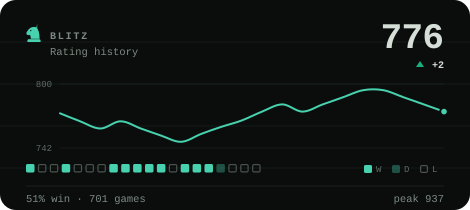

**`glass`**

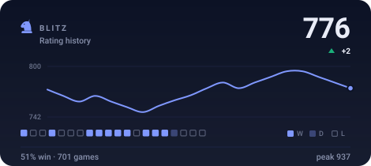

**`piece`**

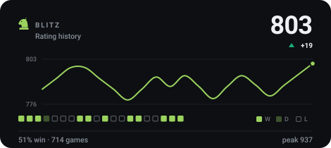

**`light`**

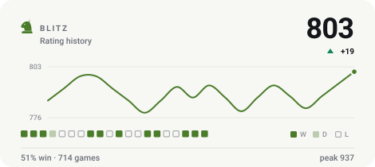

**`light-editorial`**

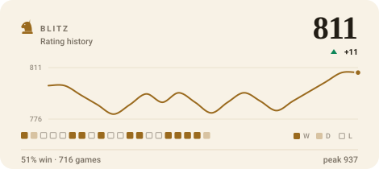

**`chess`**

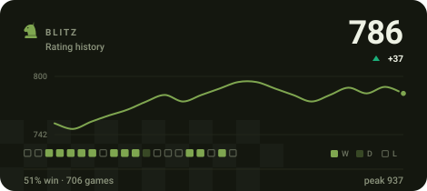

**`matrix`**

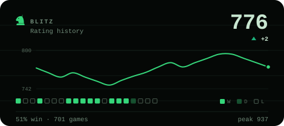

**`midnight`**

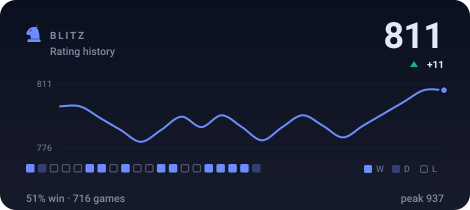

**`neon`**

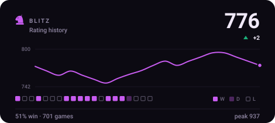

**`ocean`**

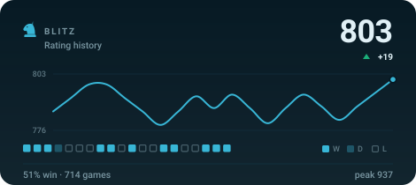

**`github`**

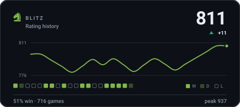

**`github-light`**

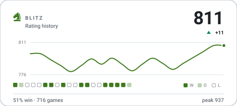

</details>

### Hero card (340×210) — single mode with piece

```markdown

```

<div align="center">
  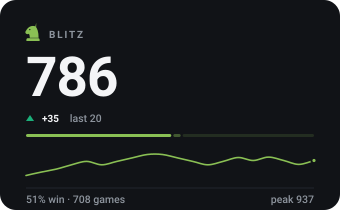
  &nbsp;
  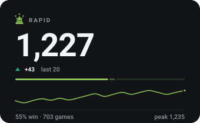
  &nbsp;
  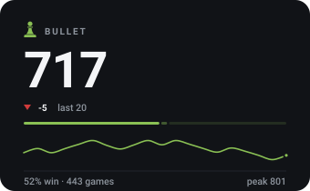
</div>

<details>
<summary>Hero card in all 15 styles</summary>

**`premium`**


**`editorial`**

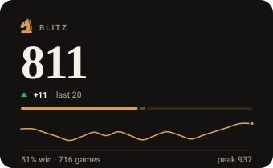

**`wood`**

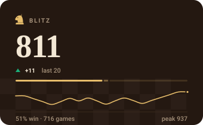

**`tech`**

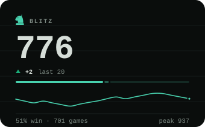

**`glass`**

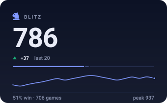

**`piece`**

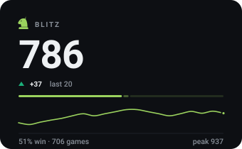

**`light`**

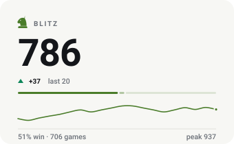

**`light-editorial`**

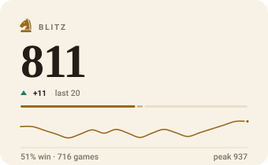

**`chess`**

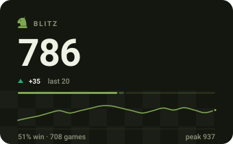

**`matrix`**

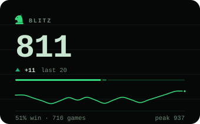

**`midnight`**

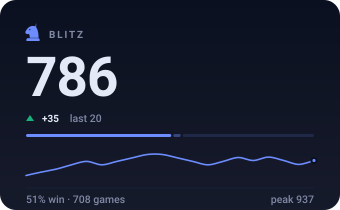

**`neon`**

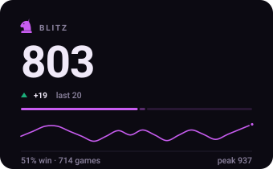

**`ocean`**

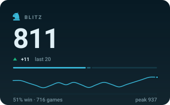

**`github`**

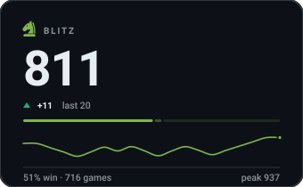

**`github-light`**

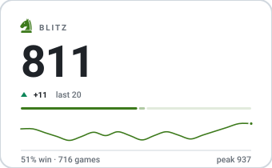

</details>

### Activity (840×226) — games per day, contribution-graph style

Last 13 weeks, with best streak, busiest day and active days.

```markdown

```

<div align="center">
  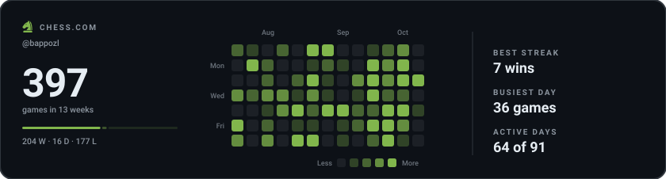
</div>

<details>
<summary>Activity in all 15 styles</summary>

**`premium`**

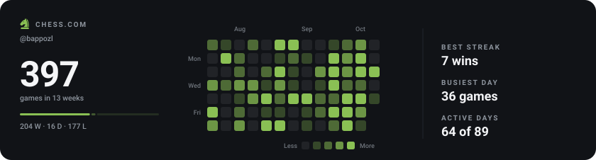

**`editorial`**


**`wood`**


**`tech`**


**`glass`**


**`piece`**


**`light`**


**`light-editorial`**


**`chess`**


**`matrix`**


**`midnight`**


**`neon`**


**`ocean`**


**`github`**


**`github-light`**


</details>

### Git log (600×248) — latest games as commits

Filled node = win, hollow = loss; the diff on the right is the rating change.

```markdown

```

<div align="center">
  
</div>

<details>
<summary>Git log in all 15 styles</summary>

**`premium`**


**`editorial`**


**`wood`**


**`tech`**


**`glass`**


**`piece`**


**`light`**


**`light-editorial`**


**`chess`**


**`matrix`**


**`midnight`**


**`neon`**


**`ocean`**


**`github`**


**`github-light`**


</details>

### Ticker (840×52) — one-line strip

Rapid, blitz and bullet with trend and sparkline.

```markdown

```

<div align="center">
  
</div>

<details>
<summary>Ticker in all 15 styles</summary>

**`premium`**


**`editorial`**


**`wood`**


**`tech`**


**`glass`**


**`piece`**


**`light`**


**`light-editorial`**


**`chess`**


**`matrix`**


**`midnight`**


**`neon`**


**`ocean`**


**`github`**


**`github-light`**


</details>

### chessfetch (600×266) — neofetch for chess

Ratings, record, win rate and recent form in a terminal window.

```markdown

```

<div align="center">
  
</div>

<details>
<summary>chessfetch in all 15 styles</summary>

**`premium`**


**`editorial`**


**`wood`**


**`tech`**


**`glass`**


**`piece`**


**`light`**


**`light-editorial`**


**`chess`**


**`matrix`**


**`midnight`**


**`neon`**


**`ocean`**


**`github`**


**`github-light`**


</details>

### Code card (450×252) — stats as a TypeScript object

Uses GitHub's own syntax colours in the `github` styles and the style accent elsewhere.

```markdown

```

<div align="center">
  
</div>

<details>
<summary>Code card in all 15 styles</summary>

**`premium`**


**`editorial`**


**`wood`**


**`tech`**


**`glass`**


**`piece`**


**`light`**


**`light-editorial`**


**`chess`**


**`matrix`**


**`midnight`**


**`neon`**


**`ocean`**


**`github`**


**`github-light`**


</details>

### Last game (540×236) — final position on the board

Seen from your side of the board, with the result as the headline.

```markdown

```

<div align="center">
  
</div>

<details>
<summary>Last game in all 15 styles</summary>

**`premium`**


**`editorial`**


**`wood`**


**`tech`**


**`glass`**


**`piece`**


**`light`**


**`light-editorial`**


**`chess`**


**`matrix`**


**`midnight`**


**`neon`**


**`ocean`**


**`github`**


**`github-light`**


</details>

### White vs Black (540×220) — win rate by colour

The halves stay light and dark in every style.

```markdown

```

<div align="center">
  
</div>

<details>
<summary>White vs Black in all 15 styles</summary>

**`premium`**


**`editorial`**


**`wood`**


**`tech`**


**`glass`**


**`piece`**


**`light`**


**`light-editorial`**


**`chess`**


**`matrix`**


**`midnight`**


**`neon`**


**`ocean`**


**`github`**


**`github-light`**


</details>

### Openings (540×268) — most played opening families

Bar length = games played; the split is win / draw / loss.

```markdown

```

<div align="center">
  
</div>

<details>
<summary>Openings in all 15 styles</summary>

**`premium`**


**`editorial`**


**`wood`**


**`tech`**


**`glass`**


**`piece`**


**`light`**


**`light-editorial`**


**`chess`**


**`matrix`**


**`midnight`**


**`neon`**


**`ocean`**


**`github`**


**`github-light`**


</details>

### Medallion (200×214) — one tile per mode

Win / draw / loss ring around the rating. One file per `{mode}`.

```markdown

```

<div align="center">
  
  &nbsp;
  
  &nbsp;
  
</div>

<details>
<summary>Medallion in all 15 styles</summary>

**`premium`**


**`editorial`**


**`wood`**


**`tech`**


**`glass`**


**`piece`**


**`light`**


**`light-editorial`**


**`chess`**


**`matrix`**


**`midnight`**


**`neon`**


**`ocean`**


**`github`**


**`github-light`**


</details>

### Bare (840×118) — type only, no frame

No background: ink follows the reader's light/dark setting via `prefers-color-scheme`; the style only sets accent and font.

```markdown

```

<div align="center">
  
</div>

<details>
<summary>Bare in all 15 styles</summary>

**`premium`**


**`editorial`**


**`wood`**


**`tech`**


**`glass`**


**`piece`**


**`light`**


**`light-editorial`**


**`chess`**


**`matrix`**


**`midnight`**


**`neon`**


**`ocean`**


**`github`**


**`github-light`**


</details>

---

## Usage examples

### Summary + two line charts

```html
<div align="center">
  
  <br/>
  
  &nbsp;&nbsp;
  
</div>
```

### Hero cards side by side (glass style)

```html
<div align="center">
  
  &nbsp;
  
</div>
```

### Clickable card

```html
<a href="https://www.chess.com/member/YOUR_CHESS_USERNAME">
  
</a>
```

---

## Updates

Stats are fetched from the Chess.com public API and regenerated **every 6 hours** via GitHub Actions (`cron: "0 */6 * * *"`). You can also trigger manually via **Actions → Run workflow**.

---

## Local development

```bash
git clone https://github.com/your-username/chess_readme_status.git
cd chess_readme_status
npm install
CHESS_USERNAME=your_username /usr/bin/node scripts/generate-svg.js
```

---

## License

MIT — see [LICENSE](LICENSE)
